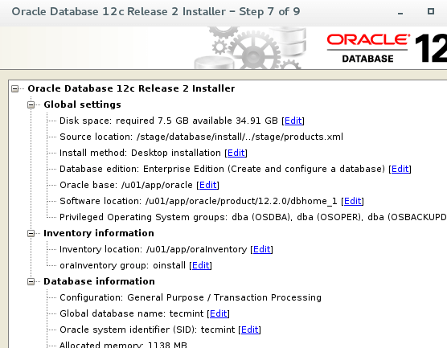

# Oracle with CentOS7
## Preparing for Oracle 12c Installation
* Dowload oracle
  * https://www.oracle.com/database/technologies/oracle-database-software-downloads.html
* Update package
```
# yum update -y
```
* Install all the required dependencies for the RDBMS
```
# yum install -y binutils.x86_64 compat-libcap1.x86_64 gcc.x86_64 gcc-c++.x86_64 glibc.i686 glibc.x86_64 glibc-devel.i686 glibc-devel.x86_64 ksh compat-libstdc++-33 libaio.i686 libaio.x86_64 libaio-devel.i686 libaio-devel.x86_64 libgcc.i686 libgcc.x86_64 libstdc++.i686 libstdc++.x86_64 libstdc++-devel.i686 libstdc++-devel.x86_64 libXi.i686 libXi.x86_64 libXtst.i686 libXtst.x86_64 make.x86_64 sysstat.x86_64 zip unzip
```
* Create the user account and groups for Oracle
```
# groupadd oinstall
# groupadd dba
# useradd -g oinstall -G dba oracle
```
* Set a password for the newly created oracle account
```
# passwd oracle
```
* Add the following kernel parameters to **/etc/sysctl.conf**
```
fs.aio-max-nr = 1048576
fs.file-max = 6815744
kernel.shmall = 2097152
kernel.shmmax = 8329226240
kernel.shmmni = 4096
kernel.sem = 250 32000 100 128
net.ipv4.ip_local_port_range = 9000 65500
net.core.rmem_default = 262144
net.core.rmem_max = 4194304
net.core.wmem_default = 262144
net.core.wmem_max = 1048586
```
* Run commands
```
# sysctl -p
# sysctl -a
```
* Set the limits for oracle in **/etc/security/limits.conf** file
```
oracle soft nproc 2047
oracle hard nproc 16384
oracle soft nofile 1024
oracle hard nofile 65536
```
* Create a directory named **/stage** and extract the zipped installation file
```
# unzip linuxx64_12201_database.zip -d /stage/
```
* Before proceeding, create other directories that will be used during the actual installation, and assign the necessary permissions
```
# mkdir /u01
# mkdir /u02
# chown -R oracle:oinstall /u01
# chown -R oracle:oinstall /u02
# chmod -R 775 /u01
# chmod -R 775 /u02
# chmod g+s /u01
# chmod g+s /u02
```
* Open a GUI session in the RHEL/CentOS 7 server and launch the installation script
```
# /stage/database/runInstaller
```

## Installing Oracle 12c on CentOS 7
* Enter the email address associated with your Oracle account (optional)


* Choose **Create** and configure a database


* Select Desktop class since we are setting up a minimal configuration and a starter database


* Select the following options for basic configuration
  * Oracle base: /u01/app/oracle
  * Software location: /u01/app/oracle/product/12.2.0/dbhome_1
  * Database file location: /u01
  * OSDBA group: dba
  * Global database name: your choice. We chose tecmint here.
  * Take note of the password, as you will be using it when you first connect to the database.
  * Uncheck Create as Container database.


* Leave the default Inventory Directory as /u01/app/oraInventory


* Verify that the installation pre-checks are completed without errors


* Wait until the Oracle 12c installation completes


* It is possible that at some point during the installation you will be asked to run a couple of scripts to set up further permissions or correct issues. This is illustrated here:


* And here:
```
# cd /u01/app/oraInventory
# ./orainstRoot.sh
# cd /u01/app/oracle/product/12.2.0/dbhome_1
# ./root.sh
```


* After that, you will need to return to the previous screen in the GUI session and click OK so that the installation can continue.

* When it is finished, you will be presented with the following message indicating the URL of the Oracle Enterprise Manager:
```
https://localhost:5500/em
```

## Oracle 12c Finishing Touches
* To allow connections from outside the server, you will need to open the following ports:
```
1521/TCP
5500/TCP
5520/TCP
3938/TCP
```
* As follows:
```
# firewall-cmd --zone=public --add-port=1521/tcp --add-port=5500/tcp --add-port=5520/tcp --add-port=3938/tcp --permanent
# firewall-cmd --reload
```
* Next, login as oracle using the password that was chosen previously and add the following lines to .bash_profilefile.
```
TMPDIR=$TMP; export TMPDIR
ORACLE_BASE=/u01/app/oracle; export ORACLE_BASE
ORACLE_HOME=$ORACLE_BASE/product/12.2.0/dbhome_1; export ORACLE_HOME
ORACLE_SID=tecmint; export ORACLE_SID
PATH=$ORACLE_HOME/bin:$PATH; export PATH
LD_LIBRARY_PATH=$ORACLE_HOME/lib:/lib:/usr/lib:/usr/lib64; export LD_LIBRARY_PATH
CLASSPATH=$ORACLE_HOME/jlib:$ORACLE_HOME/rdbms/jlib; export CLASSPATH
```
* Finally, replace localhost with 0.0.0.0 on.
```
# vi $ORACLE_HOME/network/admin/listener.ora
```


* The last step consists in reloading .bash_profile to apply the new settings.
```
# source .bash_profile
```
* And then login to the database using the system account and the password chosen in Step 11 of the previous section.
```
# sqlplus system@tecmint
```
* Optionally, let’s create a table inside the tecmint database where we will insert some sample records as follows.
```
SQL> CREATE TABLE NamesTBL
(id   NUMBER GENERATED AS IDENTITY,
name VARCHAR2(20));
```
* Please note that IDENTITY columns were first introduced in Oracle 12c
```
SQL> INSERT INTO NamesTBL (name) VALUES ('Gabriel');
SQL> INSERT INTO NamesTBL (name) VALUES ('Admin');
SQL> SELECT * FROM NamesTBL;
```


## Enabling Oracle to Start on System Boot
* To enable the database service to start automatically on boot, add the following lines to /etc/systemd/system/oracle-rdbms.service file
```
# /etc/systemd/system/oracle-rdbms.service
# Invoking Oracle scripts to start/shutdown Instances defined in /etc/oratab
# and starts Listener

[Unit]
Description=Oracle Database(s) and Listener
Requires=network.target

[Service]
Type=forking
Restart=no
ExecStart=/u01/app/oracle/product/12.2.0/dbhome_1/bin/dbstart /u01/app/oracle/product/12.2.0/dbhome_1
ExecStop=/u01/app/oracle/product/12.2.0/dbhome_1/bin/dbshut /u01/app/oracle/product/12.2.0/dbhome_1
User=oracle

[Install]
WantedBy=multi-user.target
```
* Finally, we need to indicate that the tecmint database should be brought up during boot in /etc/oratab (Y: Yes)


# Refs
* https://www.tecmint.com/install-oracle-database-12c-on-centos-7/